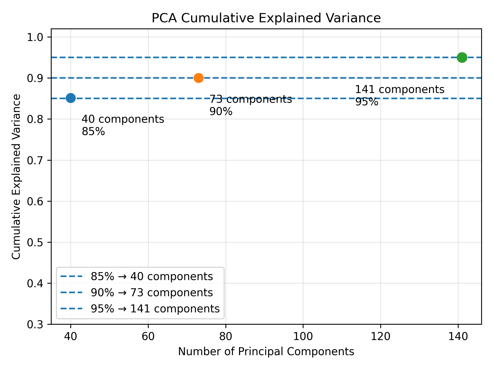
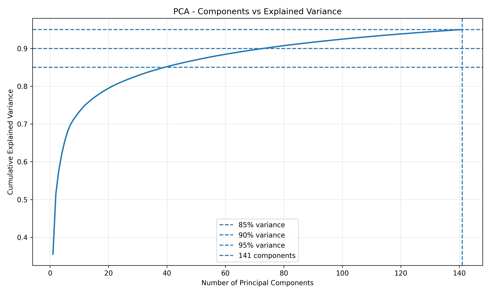
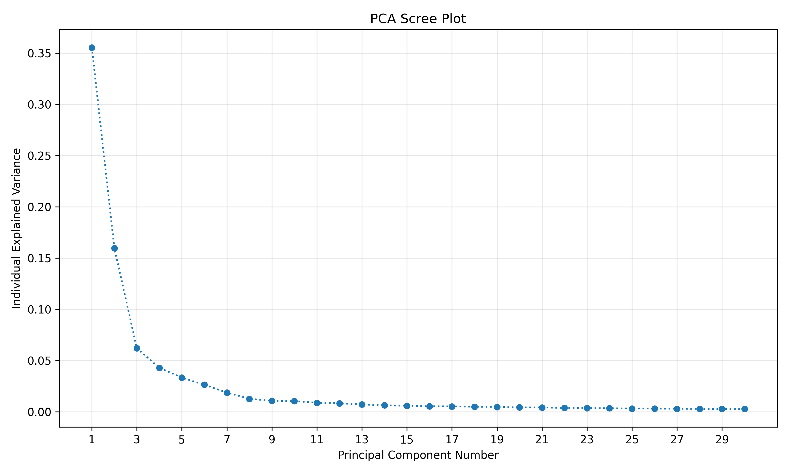
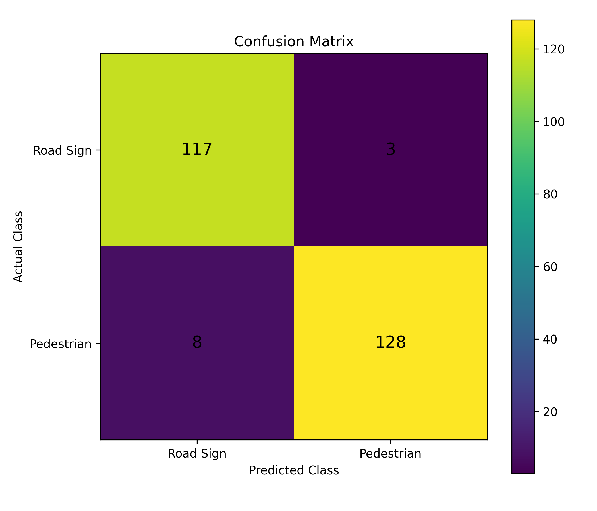
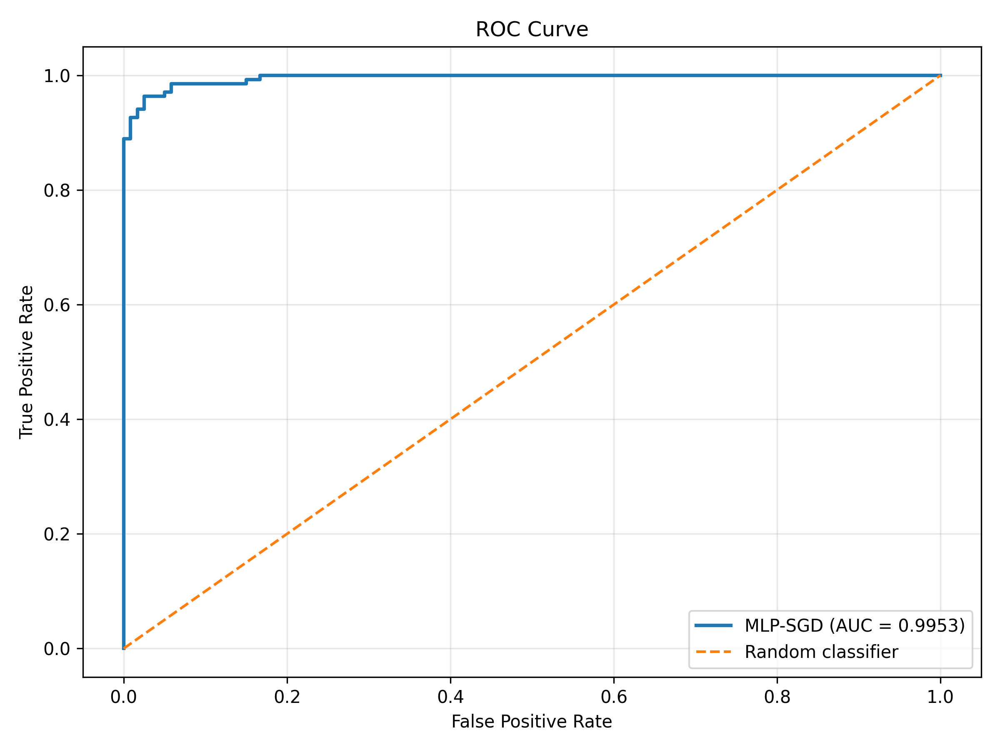
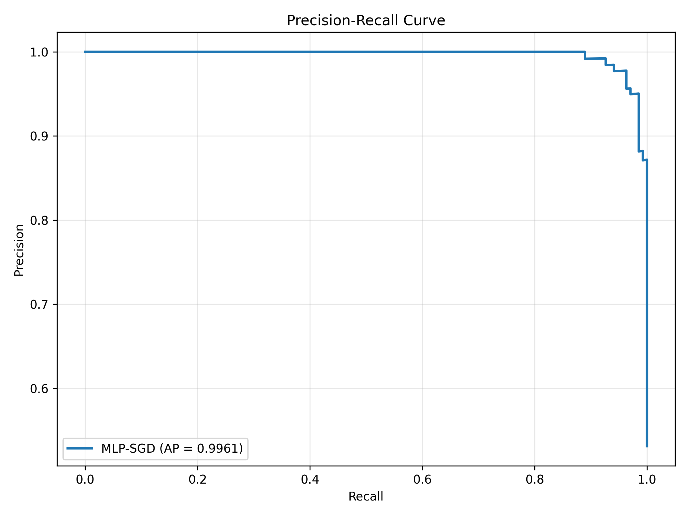

# Real-Time Road Sign and Pedestrian Classification Using PCA and MLP-SGD

Machine Learning Assignment – Question 2

This project implements an image-level classification system that identifies whether an input image contains a **Road Sign** or a **Pedestrian** under varying simulated weather and lighting conditions.

> **Important:** This project performs image-level classification, not object detection. It classifies the complete input image and does not locate objects with bounding boxes.

## Assignment Question

Design a system that identifies road signs and pedestrians in real time under varying weather conditions. Reduce input noise using PCA or SVD, train an MLP optimized with Stochastic Gradient Descent, and evaluate the system using ROC curves, precision-recall, accuracy, and F1 score. Use cross-validation to help mitigate bias and variance.

## Project Objective

The objective is to build a two-class machine-learning image classifier for:

- Road Sign
- Pedestrian

The workflow uses synthetic weather augmentation, PCA dimensionality reduction, and an MLP classifier trained with SGD.

## Dataset

Two datasets are used:

| Dataset | Images |
|---|---:|
| Penn-Fudan Pedestrian Dataset | 170 pedestrian images |
| Indian Traffic Sign Image Dataset | 150 road-sign images |
| **Total original images** | **320** |

### Synthetic Weather Augmentation

Each original image is used to generate four simulated weather or lighting conditions:

- Daylight
- Rainy
- Snow
- Night

These conditions are **synthetically generated using image-processing augmentation**. They are not real weather recordings. The augmented images simulate changing environmental conditions for the assignment.

The resulting dataset contains:

```text
320 original images × 4 conditions = 1280 images
```

| Class | Final images |
|---|---:|
| Pedestrian | 680 |
| Road Sign | 600 |
| **Total** | **1280** |

## Complete Workflow

```text
Original image
      ↓
Synthetic weather augmentation
      ↓
Image validation and loading
      ↓
Aspect-ratio-preserving resize
      ↓
Padding to 128 × 128
      ↓
Grayscale conversion
      ↓
Pixel normalization to 0–1
      ↓
Flattening into 16,384 features
      ↓
PCA dimensionality reduction
      ↓
MLP classifier trained with SGD
      ↓
Grouped cross-validation and evaluation
      ↓
Final class prediction and confidence
```

### Data Preprocessing

Images are resized while preserving their aspect ratio and then padded to `128 × 128` pixels. They are converted to grayscale, normalized to the range 0–1, and flattened into a one-dimensional feature vector.

```text
128 × 128 = 16,384 pixel features per image
```

A grouped train/test split ensures that the four weather versions generated from the same original image never appear in both training and testing sets.

| Split | Original-image groups | Images |
|---|---:|---:|
| Training | 256 | 1024 |
| Testing | 64 | 256 |

## PCA Dimensionality Reduction

Principal Component Analysis (PCA) reduces the number of input features while retaining the most important variation in the training data. In simple terms, PCA transforms the original pixel features into a smaller set of new features called principal components.

PCA is fitted only on the training data and then applied to the test data. This prevents information from the test set from influencing the feature-reduction step.

| Variance retained | Components |
|---:|---:|
| 85% | 40 |
| 90% | 73 |
| 95% | 141 |

The selected configuration retains **95% of the variance**:

```text
16,384 original features → 141 PCA components
```

This is an approximate **99.14% feature reduction**.

### PCA Results







## MLP Classifier

The classifier is a **Multi-Layer Perceptron (MLP)**. It receives the PCA-transformed features and produces a binary prediction for Road Sign or Pedestrian.

Final selected architecture:

```text
Input
  ↓
128 neurons
  ↓
64 neurons
  ↓
Output
```

The hidden-layer architecture is `(128, 64)`:

- The first hidden layer learns higher-level patterns from the PCA features.
- The second hidden layer combines those learned patterns.
- The output layer performs the final binary classification.

## SGD Optimization

The MLP is trained using **Stochastic Gradient Descent (SGD)**. SGD updates the neural-network weights based on prediction error.

The training process repeatedly:

1. Takes training data.
2. Generates predictions.
3. Calculates the loss.
4. Calculates gradients.
5. Updates the model weights.
6. Repeats until convergence or stopping criteria are reached.

Best parameters found during model selection:

| Parameter | Value |
|---|---:|
| Learning rate | 0.01 |
| Momentum | 0.95 |
| Hidden layers | `(128, 64)` |
| Best CV F1 score | 0.9177 |
| Training iterations | 36 |
| Final training loss | 0.005322 |

## Cross-Validation

The project uses **5-fold Stratified Group Cross-Validation**.

Grouped validation is important because each original image has four weather variants. All variants derived from the same original image remain in the same fold. This prevents related images from appearing in both training and validation portions, reducing the risk of data leakage.

Cross-validation also reduces the risk of relying on a misleading single train/validation split and provides a better estimate of model generalization.

## Final Held-Out Test Results

The final evaluation was performed on the held-out test set, which was not used for model training.

| Metric | Result |
|---|---:|
| Accuracy | **95.70%** |
| Precision | **97.71%** |
| Recall | **94.12%** |
| F1 Score | **95.88%** |
| ROC-AUC | **99.53%** |
| Average Precision | **99.61%** |

### Confusion Matrix

| Actual / Predicted | Road Sign | Pedestrian |
|---|---:|---:|
| **Road Sign** | 117 | 3 |
| **Pedestrian** | 8 | 128 |

Interpretation:

- 117 Road Sign images were correctly classified.
- 3 Road Sign images were classified as Pedestrian.
- 128 Pedestrian images were correctly classified.
- 8 Pedestrian images were classified as Road Sign.



## ROC and Precision-Recall Curves

The **ROC curve** shows the trade-off between the True Positive Rate and False Positive Rate at different classification thresholds.

- Final ROC-AUC: **0.9953**

The **Precision-Recall curve** shows the relationship between precision and recall at different classification thresholds.

- Final Average Precision: **0.9961**





## Manual External Image Testing

The repository also includes `predict.py` for testing unseen external images. The prediction pipeline is:

```text
New image
   ↓
Resize and padding
   ↓
Grayscale conversion
   ↓
Normalization
   ↓
Flattening
   ↓
PCA transformation
   ↓
MLP-SGD classifier
   ↓
Class prediction and confidence
```

Testing was performed using 13 unseen external images:

- 7 Road Sign images
- 6 Pedestrian images

| Result | Value |
|---|---:|
| Correct predictions | 11 / 13 |
| External manual-test accuracy | **84.62%** |
| Pedestrian | 6 / 6 correct = **100%** |
| Road Sign | 6 / 7 correct = **85.71%** |

These images came from outside the original prepared dataset, so this result must not be mixed with the official held-out test-set result. The external images include different backgrounds, sign sizes, image styles, and real-world scenes, making this an additional generalization test.

## Project Structure

```text
qb/
│
├── data/
│   ├── dataset/
│   ├── dataset_crct/
│   ├── dataset_weather/
│   └── processed/
│
├── models/
│   ├── pca.joblib
│   └── mlp_sgd.joblib
│
├── results/
│   ├── pca_cumulative_variance.png
│   ├── pca_explained_variance.png
│   ├── pca_scree_plot.png
│   ├── confusion_matrix.png
│   ├── roc_curve.png
│   ├── precision_recall_curve.png
│   └── other generated result files
│
├── src/
│   ├── rename_dataset.py
│   ├── weather_augmentation.py
│   ├── inspect_image_sizes.py
│   ├── preprocessing.py
│   ├── pca.py
│   ├── model.py
│   ├── evaluation.py
│   ├── cross_validation.py
│   └── predict.py
│
├── .gitignore
├── requirements.txt
└── README.md
```

### Important Python Files

| File | Purpose |
|---|---|
| `rename_dataset.py` | Prepares consistent dataset filenames. |
| `weather_augmentation.py` | Generates synthetic daylight, rainy, snow, and night variations. |
| `inspect_image_sizes.py` | Inspects image dimensions and dataset image properties. |
| `preprocessing.py` | Loads, validates, resizes, pads, grayscales, normalizes, and flattens images. |
| `pca.py` | Fits PCA on the training data and transforms the feature vectors. |
| `model.py` | Trains the MLP classifier using SGD. |
| `evaluation.py` | Produces predictions, metrics, the confusion matrix, ROC curve, and precision-recall curve. |
| `cross_validation.py` | Runs stratified grouped cross-validation. |
| `predict.py` | Predicts the class and confidence for a manually supplied external image. |

## How to Run

The following commands are intended for **Windows PowerShell**.

### 1. Clone the repository

```powershell
git clone https://github.com/sam27peter/qb.git
cd qb
```

### 2. Install dependencies

```powershell
pip install -r requirements.txt
```

### 3. Run preprocessing

```powershell
python src/preprocessing.py
```

### 4. Run PCA

```powershell
python src/pca.py
```

### 5. Train the MLP-SGD model

```powershell
python src/model.py
```

### 6. Run evaluation

```powershell
python src/evaluation.py
```

### 7. Run cross-validation

```powershell
python src/cross_validation.py
```

### 8. Run manual prediction

```powershell
python src/predict.py
```

The dataset files themselves may not be included in GitHub because they are large. Place the datasets in the appropriate `data/` directories before running the complete pipeline.

## Technologies Used

- Python
- NumPy
- Pillow
- Scikit-learn
- Matplotlib
- Joblib
- Principal Component Analysis (PCA)
- Multi-Layer Perceptron (MLP)
- Stochastic Gradient Descent (SGD)
- Cross-validation
- Image augmentation

## Key Features

- Two-class Road Sign and Pedestrian image classification
- Synthetic weather augmentation
- Aspect-ratio-preserving image preprocessing
- Grayscale normalization
- PCA dimensionality reduction
- 95% variance retention
- MLP neural network
- SGD optimization
- Learning-rate and momentum tuning
- Stratified Group 5-fold cross-validation
- Accuracy, precision, recall, and F1 evaluation
- ROC-AUC evaluation
- Precision-Recall evaluation
- Confusion matrix
- Manual external image prediction
- Prediction confidence output

## Limitations

1. This is an image-level classifier, not an object-detection system.
2. The model classifies the complete input image; it does not locate a Road Sign or Pedestrian using bounding boxes.
3. Weather conditions are synthetically generated rather than collected from real weather conditions.
4. External images may have different distributions from the training dataset.
5. Some Road Sign images with complex backgrounds or different visual characteristics can be misclassified.
6. The external manual test is small and should be treated as an additional demonstration rather than the primary evaluation.

## Conclusion

This project implements the required Question 2 pipeline:

```text
Dataset
→ Weather augmentation
→ Preprocessing
→ PCA
→ MLP
→ SGD optimization
→ Grouped cross-validation
→ Evaluation
→ Manual prediction
```

PCA reduced the feature space from **16,384 to 141 components** while retaining **95% variance**. The final MLP-SGD classifier achieved **95.70% accuracy** and **95.88% F1** on the held-out test set.
